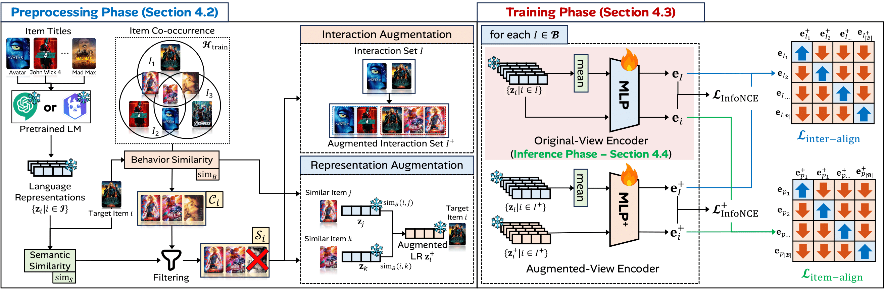

# AlphaFree
This repository provides the official implementation of **AlphaFree**, which has been accepted to ACM The Web Conference 2026. Detailed information is provided as follows.
* **AlphaFree: Recommendation Free from Users, IDs, and GNNs** </br>
Minseo Jeon, Junwoo Jung, Daewon Gwak, and Jinhong Jung</br>
ACM Web Conference 2026 (WWW '26)



## ⚙️ Prerequisites
You can install the required packages with a conda environment by typing the following command in your terminal:
```bash
conda create -n alphafree python=3.9
conda activate alphafree
# We conducted our experiments using an RTX 4090 (24GB VRAM) under PyTorch 1.13 with CUDA 11.7.
# Install with appropriate pytorch-cuda version depending on your GPU/driver.
pip install torch==1.13.1+cu117 torchvision==0.14.1+cu117 torchaudio==0.13.1 --extra-index-url https://download.pytorch.org/whl/cu117
pip install -r requirements.txt
```
Before using the recommendation, run the following command to install the evaluator:
```bash
pushd models/base
python setup.py build_ext --inplace
popd

# If any error occurs, run the following command:
conda install -c conda-forge libstdcxx-ng=13.1.0
```

## 📚 Datasets
The statistics of datasets used in AlphaFree are summarized as follows. 
| Dataset | Movie | Book | Video | Baby | Steam | Beauty | Health |
|:--|--:|--:|--:|--:|--:|--:|--:|
| **#Users** | 26,073 | 71,306 | 94,762 | 150,777 | 334,730 | 729,576 | 796,054 |
| **#Items** | 12,464 | 40,523 | 25,612 | 36,013 | 15,068 | 207,649 | 184,346 |
| **#Inter.** | 875,906 | 2,206,865 | 814,586 | 1,241,083 | 4,216,781 | 6,624,441 | 7,176,552 |

### ⬇️ Dataset downloads
You can download the dataset using the bash script at `./data/download.sh`
```bash
cd ./data
chmod +x download.sh  
./download.sh --dataset <DATASET_NAME>
# Datasets : [amazon_book_2014, amazon_movie, amazon_video, amazon_baby, steam, amazon_beauty_personal, amazon_health]
```

## 🚀 Usage

`AlphaFree` consists of three phases: 
* 1️⃣ Inference : Evaluate AlphaFree using the the pre-trained weights.
* 2️⃣ Training : Train AlphaFree from scratch.
* 3️⃣ Preprocessing : Generate Language Representations (LRs) and perform interaction/representation augmentation. (Pre-generated outputs are also included when you download the dataset.)

### 1️⃣ Inference phase
You can evaluate AlphaFree using the pre-trained weights.<br>
The pre-trained weights will be downloaded automatically from Google Drive. <br>
**Note :** You must download the dataset(s) first. 
```bash
python main.py --phase inference --dataset <DATASET_NAME> 
# Datasets : [amazon_book_2014, amazon_movie, amazon_video, amazon_baby, steam, amazon_beauty_personal, amazon_health]
```

### 2️⃣ Training phase
You can train `AlphaFree` from scratch with the validated hyperparameters for each dataset by typing the following command in your terminal:

```bash
python main.py --phase train --dataset <DATASET_NAME> 
# Datasets : [amazon_book_2014, amazon_movie, amazon_video, amazon_baby, steam, amazon_beauty_personal, amazon_health]
```
**Note:** You can modify the config file for each dataset to train with different hyperparameters.

### 3️⃣ Preprocessing phase
You can run the preprocessing phase of `AlphaFree` by typing the following command in your terminal. In this phase, you can generate Language Representations (LRs) and perform interaction/representation augmentation. 
```bash
python main.py --phase preprocessing --dataset <DATASET_NAME>
# Datasets : [amazon_book_2014, amazon_movie, amazon_video, amazon_baby, steam, amazon_beauty_personal, amazon_health]
```
**Note1:** LR generation is not supported for the amazon_book_2014 and amazon_movie datasets, since we reuse the LRs provided by [AlphaRec repo](https://github.com/LehengTHU/AlphaRec) for both datasets. <br> 
**Note2:** We also provide pre-generated LRs and augmented interactions/representations so you don’t need to spend time generating them.

### ✅ Recommendation demo
Recommendation demo using the pre-trained AlphaFree model on the movie dataset. <br>
To clearly indicate that we use only the original $\texttt{MLP}$ for inference, we provide a separate model <br> 
implementation that includes only the original $\texttt{MLP}$ (./models/AlphaFreeRecDemo.py).  
This class uses only the $\texttt{MLP}$ from a model trained with both $\texttt{MLP}^+$ (augmented view) and $\texttt{MLP}$ (original view). <br>
```bash
python demo.py 
```
**Note :** Before running the inference demo, **download the Amazon Movie dataset first.**
## 📈 Result of Pre-trained `AlphaFree`

### Trainlog
You can find the training logs of our model in the ./log folder.<br>
The test performance of the pre-trained AlphaFree on each dataset (based on ./log) is as follows: <br>
(You can also check the recommendation performance with the pre-trained parameters (1️⃣ Phase : Inference) we have provided.)
| **AlphaFree** | **Movie**  |**Book**   | **Video**  | **Baby**   | **Steam**  | **Beauty** | **Health** |
|-------------|--------|--------|--------|--------|--------|--------|--------|
| **Recall@20** | 0.1267 | 0.1025 | 0.1117 | 0.0412 | 0.2400 | 0.0371 | 0.0333 |
| **NDCG@20** | 0.1193 | 0.0869 | 0.0619 | 0.0221 | 0.1940 | 0.0205 | 0.0189 |


### Performance Table
The reported results in the paper are as follows:

| **Recall@20** | **Movie**  |**Book**   | **Video**  | **Baby**   | **Steam**  | **Beauty** | **Health** |
|-------------|--------|--------|--------|--------|--------|--------|--------|
| MF-BPR      | 0.0580 | 0.0436 | 0.0177 | 0.0150 | 0.1610 | 0.0063 | 0.0091 |
| FISM-BPR    | 0.0861 | 0.0623 | 0.0392 | 0.0150 | 0.1801 | 0.0079 | 0.0104 |
| LightGCN    | 0.0860 | 0.0712 | 0.0732 | 0.0359 | 0.2013 | 0.0201 | 0.0250 |
| XSimGCL     | 0.0967 | 0.0818 | 0.0897 | 0.0390 | 0.2245 | 0.0253 | 0.0299 |
| RLMRec      | 0.1046 | 0.0905 | o.o.t. | o.o.t. | o.o.t. | o.o.t. | o.o.t. |
| AlphaRec    | 0.1219 | 0.0991 | 0.1088 | 0.0391 | 0.2360 | o.o.m. | o.o.m. |
| **AlphaFree** | **0.1267** | **0.1014** | **0.1111** | **0.0412** | **0.2402** | **0.0361** | **0.0325** |
| **% inc. over best LR** | **3.94%** | **2.32%** | **2.11%** | **5.37%** | **1.78%** | **-** | **-** |
| **% inc. over best non-LR** | **31.00%** | **23.96%** | **23.81%** | **5.58%** | **6.99%** | **42.69%** | **8.70%** |

| **NDCG@20** | **Movie**  |**Book**   | **Video**  | **Baby**   | **Steam**  | **Beauty** | **Health** |
|-------------|--------|--------|--------|--------|--------|--------|--------|
| MF-BPR      | 0.0533 | 0.0387 | 0.0095 | 0.0074 | 0.1537 | 0.0032 | 0.0048 |
| FISM-BPR    | 0.0801 | 0.0540 | 0.0220 | 0.0076 | 0.1431 | 0.0044 | 0.0060 |
| LightGCN    | 0.0754 | 0.0597 | 0.0409 | 0.0185 | 0.1518 | 0.0110 | 0.0142 |
| XSimGCL     | 0.0866 | 0.0690 | 0.0500 | 0.0203 | 0.1664 | 0.0140 | 0.0170 |
| RLMRec      | 0.0942 | 0.0741 | o.o.t. | o.o.t. | o.o.t. | o.o.t. | o.o.t. |
| AlphaRec    | 0.1141 | 0.0829 | 0.0605 | 0.0210 | 0.1884 | o.o.m. | o.o.m. |
| **AlphaFree** | **0.1194** | **0.0861** | **0.0615** | **0.0219** | **0.1938** | **0.0200** | **0.0184** |
|  **% inc. over best LR** | **4.65%** | **3.86%** | **1.65%** | **5.71%** | **2.89%** | **-** | **-** |
| **% inc. over best non-LR**  | **37.90%** | **24.78%** | **23.07%** | **9.26%** | **16.49%** | **42.86%** | **8.24%** |


* o.o.t. : Out of Time
* o.o.m. : Out of Memory

### Validated hyperparameters of AlphaFree
| **Hyperparam** | **Movie**  |**Book**   | **Video**  | **Baby**   | **Steam**  | **Beauty** | **Health** |
|:-------------:|:--------:|:--------:|:--------:|:--------:|:--------:|:--------:|:--------:|
| $K_c$      | 5 | 5 | 10 | 10 | 3 | 10 | 5 |
| $\lambda_{\texttt{align}}$    | 0.2 | 0.2 | 0.05 | 0.01 | 0.01 | 0.01 | 0.01 |
| $\tau_a$    | 0.2 | 0.1 | 0.01 | 0.2 | 0.2 | 0.1 | 0.2 |
| $\tau_r$     | 0.15 | 0.15 | 0.2 | 0.2 | 0.2 | 0.2 | 0.15 |
| $d_{LR}$      | 3072 | 3072 | 4096 | 4096 |4096 |4096 | 4096 |

**Description of each hyperparameter**
* $K_c$ : The number of similar items (`--K_c`).
* $\lambda_{\texttt{align}}$ : The alignment loss weight (`--lambda_align`).
* $\tau_a$ : The alignment temperature (`--tau_a`).
* $\tau_r$ : The recommendation temperature (`--tau_r`).
* $d_{LR}$ : The dimension of Language Representations (Depends on the Language Model).


